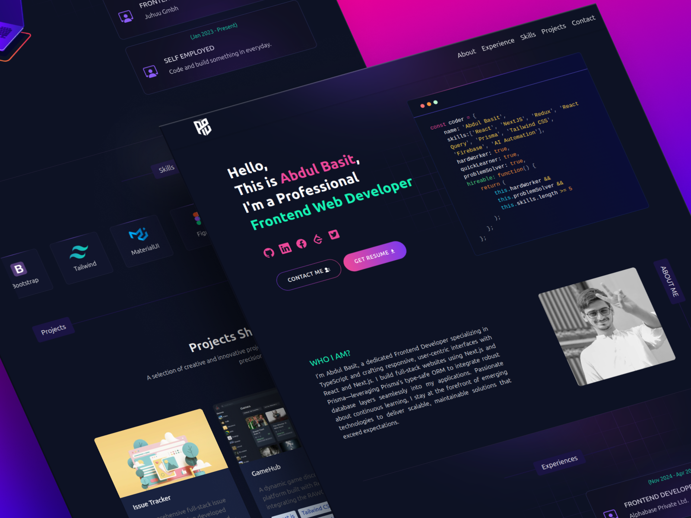

# 🌐 Abdul Basit — Personal Portfolio

Welcome to my **developer portfolio** built with **Next.js 15**, **Tailwind CSS**, and modern web tools. This site showcases my journey, skills, and projects — all wrapped in a sleek, animated, and responsive UI.

---
## 📸 Screenshot


---
## 🚀 Live Demo

🔗 [Visit Portfolio Website](https://abdul-basit-portfolio-website.vercel.app/)

---

## 🧠 Tech Stack

- ⚡ **Framework**: [Next.js 15](https://nextjs.org/)
- 🎨 **Styling**: [Tailwind CSS 3](https://tailwindcss.com/)
- 💻 **TypeScript**: Fully typed components & utilities
- 🧩 **Animations**: [Lottie React](https://www.npmjs.com/package/lottie-react)
- 📧 **Contact**: [EmailJS](https://www.emailjs.com/) integration
- 📦 **PWA Ready**: Uses [`@ducanh2912/next-pwa`](https://www.npmjs.com/package/@ducanh2912/next-pwa)
- 🔐 **reCAPTCHA v3**: [Google reCAPTCHA](https://www.npmjs.com/package/react-google-recaptcha)
- 🧠 **Icons**: [Lucide](https://lucide.dev/), [React Icons](https://react-icons.github.io/)
- ✅ **Prettier + ESLint**: Enforced code style & formatting
- 🧪 **Husky**: Git hooks for pre-commit checks

---

## 📁 Folder Structure

```
ghost-oo5-personal-portfolio-website/
├── public/                  # Static assets, Lottie, images, icons
├── src/app/
│   ├── components/          # Reusable UI & page sections
│   ├── pages/               # Page-specific components (About, Projects, etc.)
│   ├── css/                 # Custom CSS (e.g., card effects)
│   ├── fonts/               # Custom fonts
├── utils/                   # Helper functions & data (skills, projects, etc.)
├── .husky/                  # Git pre-commit hook
├── tailwind.config.ts       # Tailwind theme configuration
├── next.config.ts           # Next.js + PWA configuration
```

---

## 🛠️ Getting Started

### 1. Clone this repo

```bash
git clone https://github.com/your-username/your-portfolio.git
cd your-portfolio
```

### 2. Install dependencies

```bash
pnpm install
# or
npm install
# or
yarn install
```

### 3. Run the development server

```bash
pnpm dev
# or
npm run dev
```

Then visit: [http://localhost:3000](http://localhost:3000)

---

## 🧪 Environment Variables

Copy `.env.example` and create `.env.local`:

```env
NEXT_PUBLIC_EMAILJS_SERVICE_ID=
NEXT_PUBLIC_EMAILJS_TEMPLATE_ID=
NEXT_PUBLIC_EMAILJS_PUBLIC_KEY=
```

---

## 📦 Deployment

deployed  [here](https://abdul-basit-portfolio-website.vercel.app/)

---

## 📄 License

This project is open-source and available under the [MIT License](LICENSE).

---

## 📬 Contact Me

Got a project in mind or just want to say hi?

📧 [rajaabdulbasit005@gmail.com](mailto:rajaabdulbasit005@gmail.com)  

```
